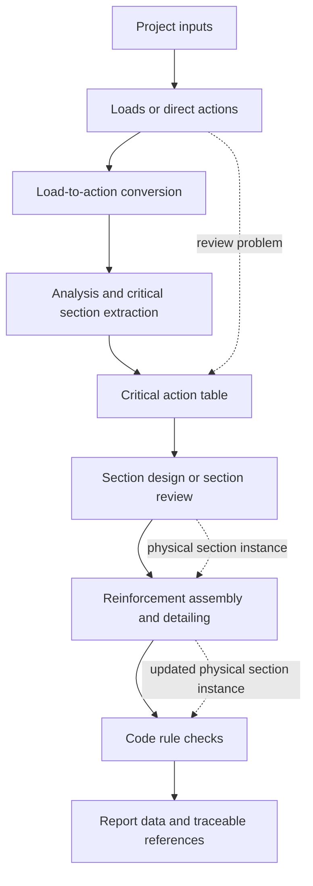
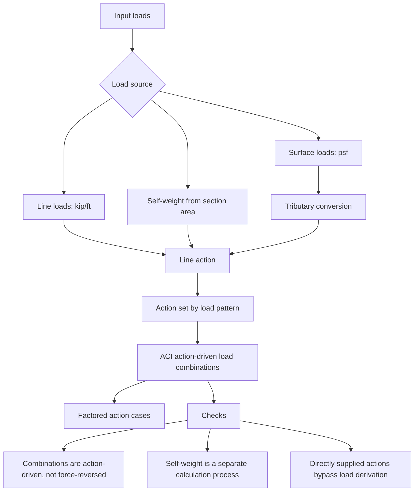
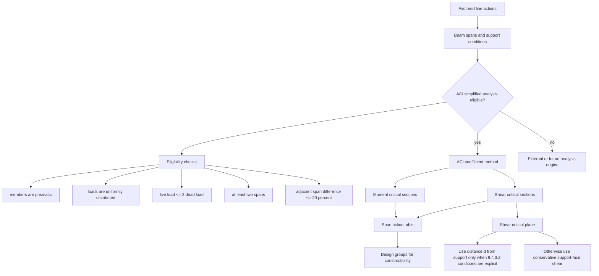
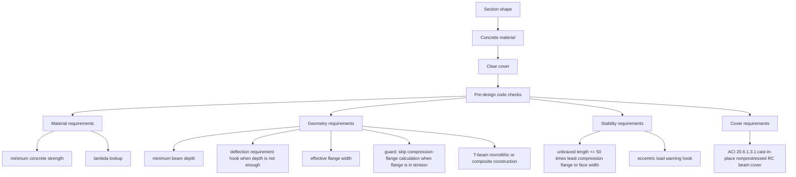
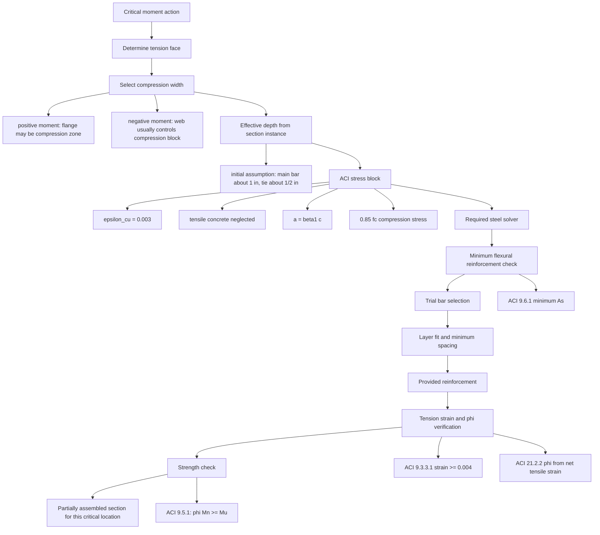
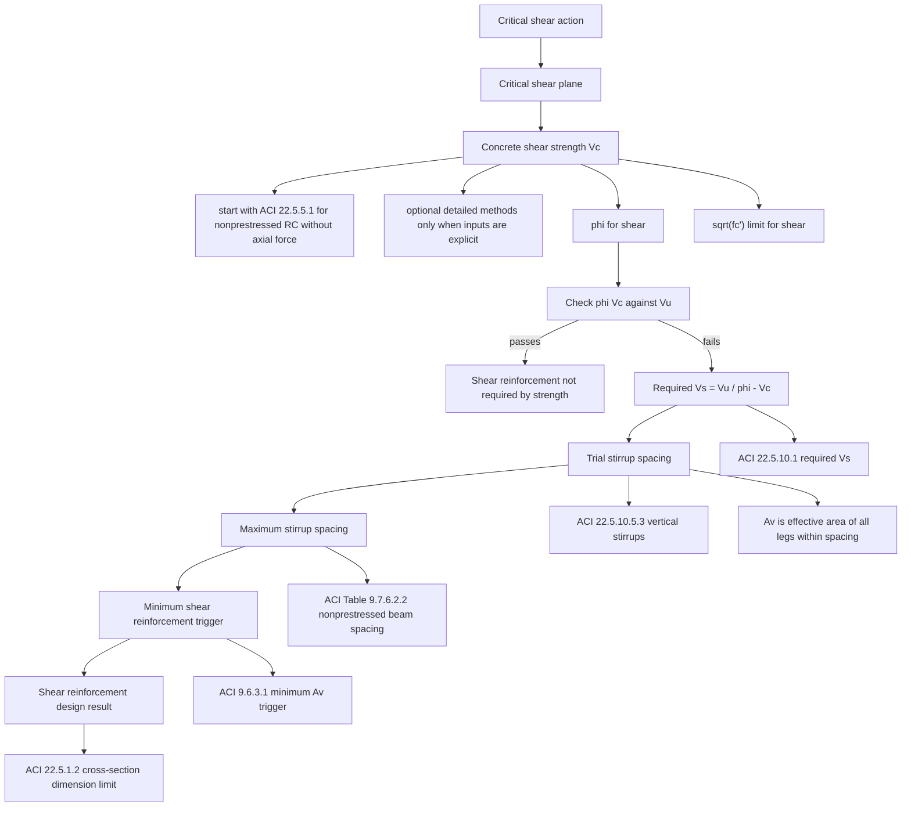
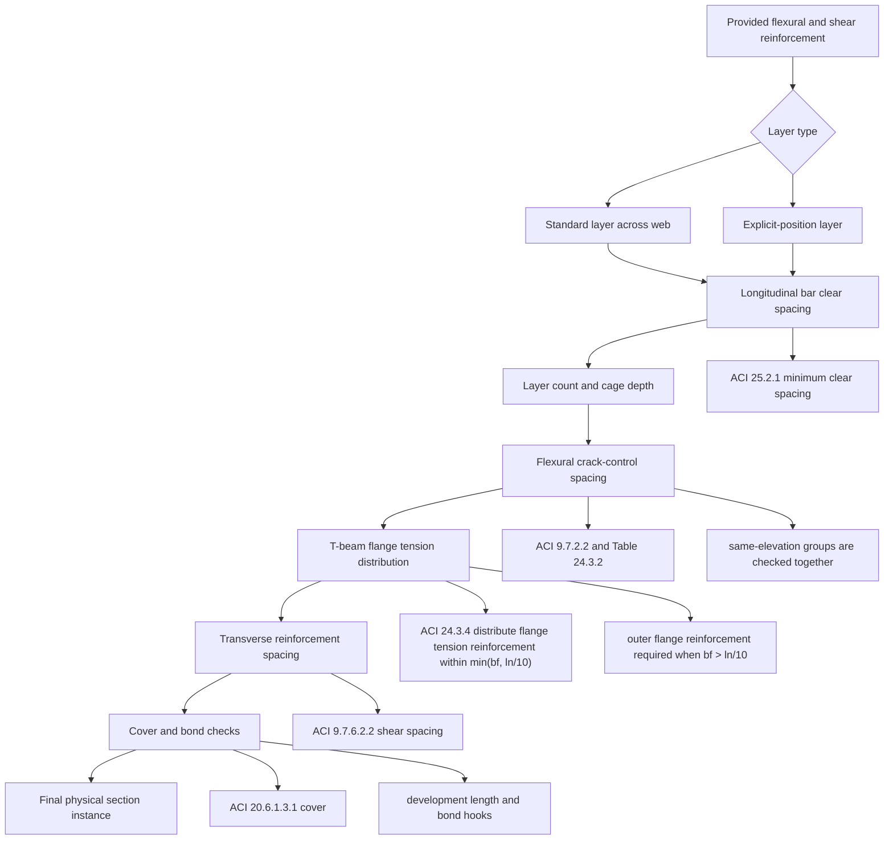
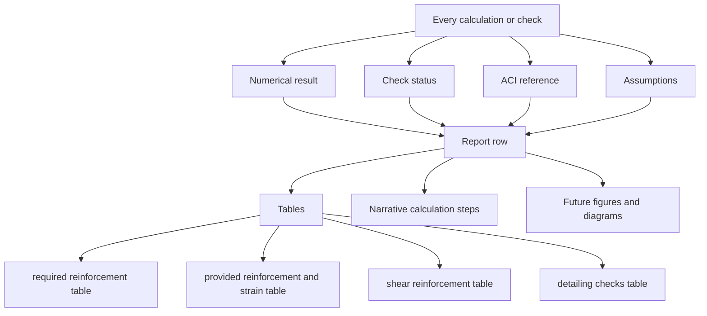

# RC Beam Design Workflow

This document records the process boundaries for the current beam-design
architecture. The charts are intentionally split into smaller workflows so each
process can evolve without turning the system into one large coupled pipeline.

ACI SP-17 examples are used as verification fixtures. They guide test values and
report shape, but they do not own the architecture.

## 1. Overall Process

Core rule: analysis belongs to the beam/action system. Section design starts
from actions. Section assembly owns physical geometry, cover, and reinforcement.

## 2. Loads To Actions

Important boundary: loads and forces can derive actions, but combined actions
should not be reversed back into loads.

## 3. Analysis And Critical Sections

Flexure and shear are stored separately because their critical sections usually
do not occur at the same physical location.

## 4. Geometry, Material, And Pre-Design Checks

The shape module remains code-neutral. ACI can constrain or transform section
metadata, but the physical section remains the shared source of truth.

## 5. Flexural Section Design

The required-steel solver is intentionally small. It receives moment, effective
depth, stress block data, and steel strength. Bar selection and detailing are
separate because constructibility is harder than the strength equation.

## 6. Shear Section Design

Active flow is limited to nonprestressed reinforced concrete beams. Prestressed,
joist, steel-fiber, and non-beam exception branches are intentionally outside
the active design path.

## 7. Reinforcement Detailing

The explicit-position layer is the current escape hatch for real detailing
cases such as SP-17 section D-D, where some top tension bars are outside the web
and do not share the same center-to-center spacing as the web bars.

## 8. Reporting Data

The report layer should consume structured results. It should not recalculate
design values.

## Current Integration Notes

- The current automated suite passes with the active ACI RC beam workflow.
- Flexural strength, shear strength, and detailing checks are connected through
  section design, reinforcement assembly, and rule modules.
- The section instance is the physical source of truth once reinforcement is
  assembled.
- The remaining hard problem is not the strength equations; it is the bar layer
  selector that must choose economical, constructible reinforcement while
  satisfying minimum spacing, maximum crack-control spacing, layer limits, and
  T-beam flange tension distribution.
- TODO: verify the SP-17 design-aid basis for the 11 in center-to-center spacing
  from the outer web bar to the outside-web top bar. The current model records
  it as explicit detailing geometry and checks it, but the exact design-aid
  origin is still open.

